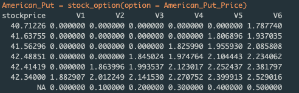

[](http://quantlet.de/)

## [](http://quantlet.de/) **SFEbitreeKO** [](http://quantlet.de/)
```yaml

Name of QuantLet : SFEbitreeKO

Published in : Statistics of Financial Markets

Description : 'Computes European/American option prices using a binomial tree for the CocaCola (KO) stock with fixed
	       amount dividends.'
	      
Keywords : 'binomial, tree, asset, call, put, option, option-price, european-option, dividends,
	    financial, black-scholes'

Author : Alice Drube
```

### R Code
```R

# Set Working Directory -------------------------------------------------------
# setwd('C:/...') 
# setwd('~/...')                # linux/mac os
# setwd('/Users/...')           # windows

path <- "..."                   #specified by the user
setwd(path)

# clear variables and close windows
rm(list = ls(all = TRUE))
graphics.off()


# load packages ---------------------------------------------------------------
#install.packages('quantmod') 
#install.packages('dplyr')
#library(quantmod)              #only need this if you download data from yahoo
library(dplyr)
library(DT)
library(readr)


# Data ------------------------------------------------------------------------
KO = read_delim("KO_Bloomberg.csv", ";", escape_double = FALSE, 
                locale = locale(decimal_mark = ","), trim_ws = TRUE)
KO = KO[, c("Date", "KO.Open", "KO.High", "KO.Low", "KO.Close", 
            "KO.Volume")]

#instead of using Bloomberg, download the data from yahoo finance
#cc = new.env()
#getSymbols("KO", env = cc, src = "yahoo", from = as.Date("2016-01-01"), 
#           to = as.Date("2019-01-04"))
#coca = cc$KO


# input parameters ------------------------------------------------------------
print("Please select Price of Underlying Asset s0 from the Data, choose 
      Exercise Price k, input Domestic Interest Rate per Year i,")
print("calculate Volatility per Year sig, choose Time to Expiration (Years) t,
      Number of steps n, type")
print("yields vector [s0, k, i, sig, t, n, type]=")

#calculate volatility
KOxts = xts(KO, KO$Date) 
KOxts = subset(KOxts, select = -c(Date) )
storage.mode(KOxts) = "numeric"
KOxts = na.locf(KOxts)
volatility = volatility(OHLC = KOxts, n = 3, calc = "garman.klass", N = 1, 
                         mean0 = TRUE)
vol = volatility %>% 
  data.frame(date = index(volatility), coredata(volatility)) %>% 
  mutate(year = strftime(date, "%Y")) %>% 
  group_by(year) %>% 
  summarise(sig = mean(coredata.volatility., na.rm = T))
rm(volatility, KOxts)

KO = KO %>% arrange(Date) %>% filter(strftime(Date, "%Y") >2017)

s0 = KO[1,2]       # Stock price, select the price you want from KO
k = 45.8           # Exercise price
i = 0.0175         # Rate of interest (INTERNET!)
sig = vol$sig[2]   # Volatility
t = 0.5            # Time to expiration
n = 5              # Number of intervals
type = 0           # 0 is American/1 is European


# check conditions ------------------------------------------------------------
if (s0 <= 0) {
    print("SFEBiTree: Price of Underlying Asset should be positive! Please 
          input again. s0=")
    s0 = scan()
}
if (k < 0) {
    print("SFEBiTree: Exercise price couldnot be negative! Please input again. 
          k=")
    k = scan()
}
if (sig < 0) {
    print("SFEBiTree: Volatility should be positive! Please input again. sig=")
    sig = scan()
}
if (t <= 0) {
    print("SFEBiTree: Time to expiration should be positive! Please input 
          again. t=")
    t = scan()
}
if (n < 1) {
    print("SFEBiTree: Number of steps should be at least equal to 1! Please 
          input again. n=")
    n = scan()
}


# input parameters ------------------------------------------------------------
print(" ")
print("Please input option choice (1 for call, 0 for put) flag, Number of pay 
      outs nodiv, time point of dividend payoff tdiv")
print("dividend in currency units for each time point pdiv as: 
      [1 2 0.25 0.5 1 1]")
print("[flag, nodiv tdiv pdiv ]=")
para2 = scan()

while (length(para2) < (2 * nodiv + 2)) {
    print("Not enough input arguments. Please input in 1*(2+2*nodiv) vector 
          form like [1 2 0.25 0.5 1 1]")
    print("[flag, nodiv tdiv pdiv ]=")
    para2 = scan()
}

flag = 0              # 0 for put option choice, 1 for call option 
nodiv = 2             # Times of dividend payoff
tdiv = c(0.25, 0.5)   # Time point of dividend payoff
pdiv = c(1, 1)        # Dividend in currency units

if (t < max(tdiv)) {
    print("SFEBiTree: Payoff shall happend before expiration! Please input tdiv
          again as [0.25 0.5]. tdiv=")
    tdiv = scan()
}

if (sum(pdiv) < 0) {
    print("SFEBiTree: Dividend must be nonnegative! Please input pdiv again as
          [1 1]. pdiv=")
    pdiv = scan()
}


# Main computation ------------------------------------------------------------
dt = t/n                                      # Interval of step
u = exp(sig * sqrt(dt))                       # Up movement parameter u
d = 1/u                                       # Down movement parameter d
b = i                                         # Costs of carry
p = 0.5 + 0.5 * (b - sig^2/2) * sqrt(dt)/sig  # Probability of up movement
tdivn = floor(tdiv/t * n - 1e-04) + 1
s = matrix(1, n + 1, n + 1) * s0
un = rep(1, n + 1) - 1
un[n + 1] = 1
dm = t(un)
um = matrix(0, 0, n + 1)
j = 1


while (j < n + 1) {
  d1 = cbind(t(rep(1, n - j) - 1), t((rep(1, j + 1) * d)^(seq(1, j + 1) - 1)))
  dm = rbind(dm, d1)  # Down movement dynamics
  u1 = cbind(t(rep(1, n - j) - 1), t((rep(1, j + 1) * u)^((seq(j, 0)))))
  um = rbind(um, u1)  # Up movement dynamics
  j = j + 1
}

um = t(rbind(un, um))
dm = t(dm)
s = s[1, 1] * um * dm  # stock price development
j = 1
m = matrix(0, nrow(s), ncol(s))

while (j <= nodiv) {
  m[, (tdivn[j] + 1):(n + 1)] = m[, (tdivn[j] + 1):(n + 1)] - pdiv[j]
  j = j + 1
}
loopj = seq(n + 1, 1)
for (j in loopj) {
  hmat = rbind(s[j, 1:6] + m[j, 1:6], matrix(0, 1, n + 1))
  s[j, 1:6] = pmax(hmat[1, ], hmat[2, ])
}

Stock_Price = s
s = s[nrow(s):1, ]  # Rearangement
opt = matrix(0, nrow(s), ncol(s))

# Option is an American call
if ((flag == 1) && (type == 0)) {
  opt[, n + 1] = pmax(s[, n + 1] - k, 0) # Determine option values from prices
  loopv = seq(n, 1)
  for (j in loopv) {
      l = seq(1, j)
      # Probable option values discounted back one time step
      discopt = ((1 - p) * opt[l, j + 1] + p * opt[l + 1, j + 1]) * exp(-b * dt)
      # Option value is max of current price - X or discopt
      opt[, j] = rbind(t(t(pmax(s[l, j] - k, discopt))), t(t(rep(0, n + 1 - 
                                                                    j))))
    }
  American_Call_Price = as.data.frame(opt[nrow(opt):1, ])
  print(American_Call_Price)
  print(" ")
  print("The price of the option at time t_0 is")
  print(American_Call_Price[n + 1, 1])
}

if ((flag == 1) && (type == 1)) {
  # # Option is a European call
  opt[, n + 1] = pmax(s[, n + 1] - k, 0)  # Determine option values from prices
  loopv = seq(n, 1)
  for (j in loopv) {
      l = seq(1, j)
      # Probable option values discounted back one time step
      discopt = ((1 - p) * opt[l, j + 1] + p * opt[l + 1, j + 1]) * exp(-b * 
                                                                           dt)
      # Option value
      opt[, j] = rbind(t(t(discopt)), t(t(rep(0, n + 1 - j))))
  }
  European_Call_Price = as.data.frame(opt[nrow(opt):1, ])
  print(European_Call_Price)
  print(" ")
  print("The price of the option at time t_0 is")
  print(European_Call_Price[n + 1, 1])
}

if ((flag == 0) && (type == 0)) {
  # # Option is an American put
  opt[, n + 1] = pmax(k - s[, n + 1], 0)  # Determine option values from prices
  loopv = seq(n, 1)
  for (j in loopv) {
      l = seq(1, j)
      # Probable option values discounted back one time step
      discopt = ((1 - p) * opt[l, j + 1] + p * opt[l + 1, j + 1]) * exp(-b * 
                                                                           dt)
      # Option value is max of X - current price or discopt
      opt[, j] = rbind(t(t(pmax(k - s[l, j], discopt))), t(t(rep(0, n + 1 - 
                                                                    j))))
  }
  American_Put_Price = as.data.frame(opt[nrow(opt):1, ] ) 
  print(American_Put_Price)
  print(" ")
  print("The price of the option at time t_0 is")
  print(American_Put_Price[n + 1, 1])
}

if ((flag == 0) && (type == 1)) {
  # # Option is a European put
  opt[, n + 1] = pmax(k - s[, n + 1], 0)  # Determine option values from prices
  loopv = seq(n, 1)
  for (j in loopv) {
      l = seq(1, j)
      # Probable option values discounted back one time step
      discopt = ((1 - p) * opt[l, j + 1] + p * opt[l + 1, j + 1]) * exp(-b * 
                                                                           dt)
      # Option value
      opt[, j] = rbind(t(t(discopt)), t(t(rep(0, n + 1 - j))))
  }
  European_Put_Price = as.data.frame(opt[nrow(opt):1, ])
  print(European_Put_Price)
  print(" ")
  print("The price of the option at time t_0 is")
  print(European_Put_Price[n + 1, 1])
}


# Adjustments -----------------------------------------------------------------
stockprice = 0
for (i in c(0:n+1)) {
  stockprice[i] = s[i,i]
}
stockprice = as.data.frame(stockprice) %>% mutate(no = c(1:(n+1))) %>% 
  arrange(desc(no)) %>% select(stockprice)


time1 = 0
for (i in c(0:n)) {
  time1[i] = dt * i 
}

time = as.data.frame(matrix(c(0, time1), nrow = 1, ncol = n+1))
rm(time1)


stock_option = function(option){
  stockprice %>% bind_cols(option) %>% 
    bind_rows(time,.id = NULL) %>% 
    print()
}

#choose option
#American_Put = stock_option(option = American_Put_Price) 
#American_Call = stock_option(option = American_Call_Price)
#European_Call = stock_option(option = European_Call_Price)
#European_Put = stock_option(option = European_Put_Price)
```
